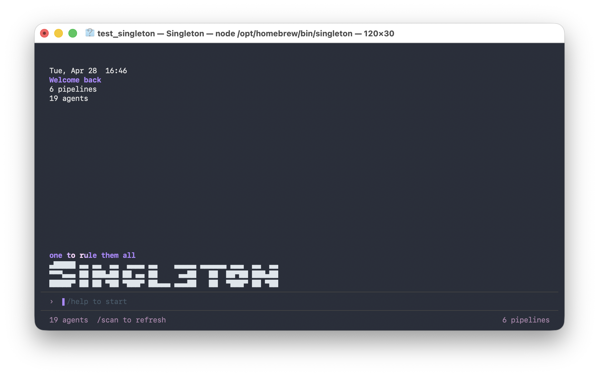
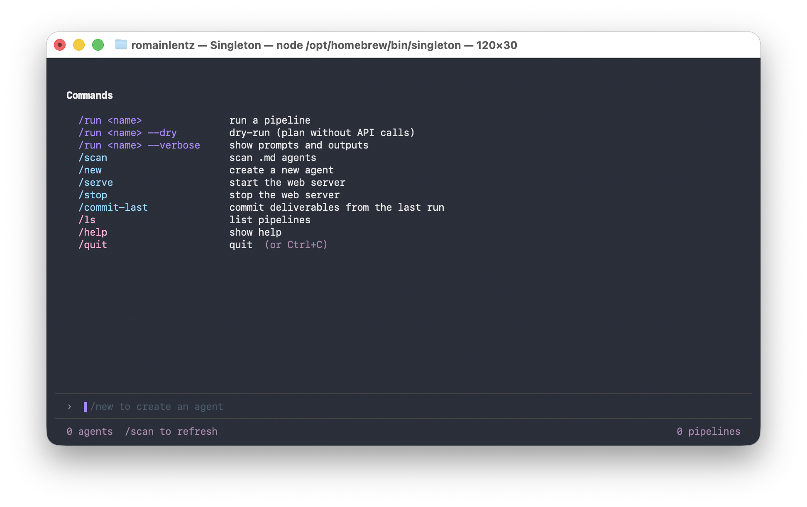
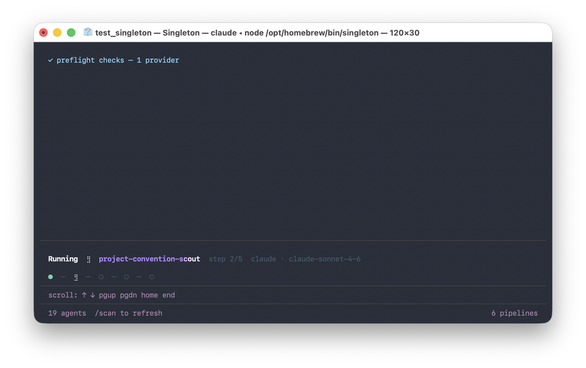
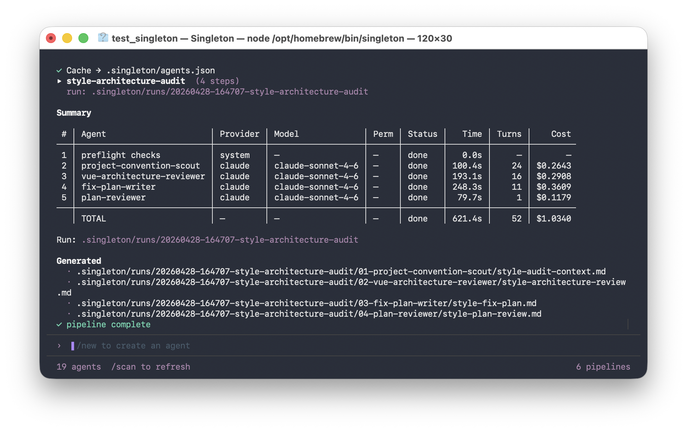
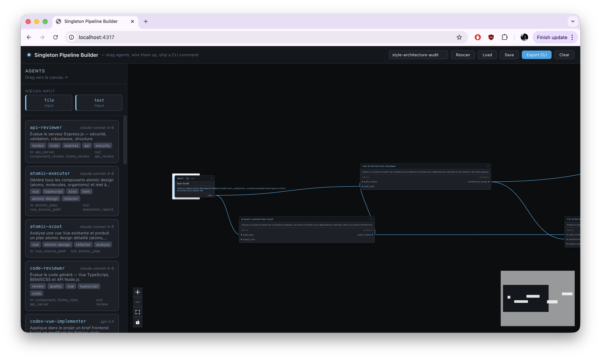

# Singleton Pipeline Builder (Beta)

Singleton is a local-first multi-agent pipeline runner for codebases. It lets you define agents as Markdown files, connect them visually, execute them with Claude or Codex, inspect runs, and commit generated deliverables.

Singleton stores everything inside the target project:

- agents in `.singleton/agents`
- pipelines in `.singleton/pipelines`
- run artifacts in `.singleton/runs`

Need a deeper explanation of nodes, references, commands, and execution rules?
See the full [reference documentation](docs/reference.md).

## Status

Singleton is an early beta.

- the core local workflow is working
- Claude and Codex runners are supported
- the pipeline format may still evolve
- CLI and builder UX are under active development

## Features

- Scan agents from `.singleton/agents`, with fallback to `.claude/agents`
- Create agents via CLI or REPL with a guided `## Config` scaffold
- Run pipelines with `$INPUT`, `$FILE`, `$PIPE`, and `$FILES`
- Run agents with Claude or Codex
- Preflight validation before execution
- Execution recap with provider, model, status, duration, cost, and written files
- Versioned run workspace in `.singleton/runs/<run-id>`
- Commit deliverables with `/commit-last`
- Start and stop the builder API with `/serve` and `/stop`

## Supported Providers

### `claude`

- executes agents through the local Claude CLI
- supports optional `permission_mode`

### `codex`

- executes agents through the local Codex CLI
- automatically injects project instructions from:
  - `AGENTS.md`
  - `AGENTS.override.md`

Notes:

- `.singleton/agents` contains executable Singleton agents
- `AGENTS.md` is not treated as an agent
- `AGENTS.md` is forwarded only to Codex as project context

## Requirements

- Node.js 20+
- npm
- `claude` available in your shell for Claude runs
- `codex` available in your shell for Codex runs

Dry runs do not call any LLM CLI.

## Install

```bash
npm install
```

Run locally:

```bash
npm run singleton -- --help
```

Or link globally:

```bash
npm link
singleton --help
```

## Project Structure

Each project owns its own workspace:

```txt
my-project/
  .singleton/
    agents/
    agents.json
    pipelines/
    runs/
```

Notes:

- `.singleton/` belongs to the target project
- `.claude/agents` is scanned for compatibility
- `AGENTS.md` is only used for Codex context

## Pipeline Model

A pipeline is a directed graph:

- input nodes provide runtime values or files
- agent nodes execute Markdown agents
- edges map outputs to downstream inputs

Steps are executed in dependency order based on `$PIPE` references.

References are serialized using:

- `$INPUT:<id>`
- `$FILE:<path>`
- `$PIPE:<agent>.<output>`
- `$FILES:<dir>`

If no provider is specified, Singleton defaults to `claude`.

## Minimal Pipeline Example

```json
{
  "steps": [
    {
      "agent": "code-generator",
      "inputs": {
        "spec": "$INPUT:input-spec"
      }
    },
    {
      "agent": "code-review",
      "inputs": {
        "source_code": "$PIPE:code-generator.source_code"
      }
    }
  ]
}
```

## Quickstart

Scan a project:

```bash
node packages/cli/src/index.js scan /path/to/project
```

Start the API server:

```bash
node packages/cli/src/index.js serve --root /path/to/project
```

Start the builder:

```bash
cd packages/web
npm run dev
```

Then open:

```txt
http://localhost:5173
```

## Workflow

The typical workflow looks like this:

1. scan a target project for available agents
2. create or refine agents in `.singleton/agents`
3. build or edit a pipeline in `.singleton/pipelines`
4. run the pipeline from the CLI or REPL
5. inspect the run summary and generated artifacts
6. commit project deliverables with `/commit-last`

This separation is intentional:

- agents define reusable behavior
- pipelines define orchestration
- runs record execution and outputs
- the target project remains the source of truth

## Screenshots

### Home



### Help



### Pipeline Run



### Pipeline Summary



### Serve Mode



## CLI

Run a pipeline:

```bash
node packages/cli/src/index.js run --pipeline /path/to/project/.singleton/pipelines/my-pipeline.json
```

Dry run:

```bash
node packages/cli/src/index.js run --pipeline /path/to/project/.singleton/pipelines/my-pipeline.json --dry-run
```

Verbose:

```bash
node packages/cli/src/index.js run --pipeline /path/to/project/.singleton/pipelines/my-pipeline.json --verbose
```

Start the REPL:

```bash
node packages/cli/src/index.js
```

Commands:

```txt
/run <name> [--dry] [--verbose]
/scan
/new
/serve
/stop
/commit-last
/ls
/help
/quit
```

Autocomplete is available with `Tab`.

## REPL

The interactive shell is more than a command launcher. It provides:

- command autocomplete with `Tab`
- persistent command history
- scrollable logs
- a pipeline execution mode with step status and live footer metadata
- a permanent footer with agent count, pipeline count, and active `/serve` state
- inline `/new` prompts inside the shell input

Useful runtime commands:

- `/scan` refreshes the agent cache
- `/serve` starts the builder API server
- `/stop` stops the builder API server
- `/commit-last` stages and commits the last run deliverables

## Example Project

An official mixed-provider example lives in:

```txt
examples/mixed-claude-codex
```

It includes:

- Claude agents in `.claude/agents`
- a Codex agent in `.singleton/agents`
- Codex instruction files in `AGENTS.md`
- a mixed pipeline

Run it with:

```bash
node packages/cli/src/index.js run --pipeline examples/mixed-claude-codex/.singleton/pipelines/contact-view-polish-mixed.json --dry-run
```

## Agent Format

Agents are Markdown files with a `## Config` section and a prompt.

```markdown
# Code Generator

## Config

- **id**: code-generator
- **description**: Generates source code
- **inputs**: spec, guidelines
- **outputs**: source_code
- **provider**: claude
- **model**: claude-sonnet-4-6

---

## Prompt

Generate the requested code.
```

Required fields:

- `id`
- `description`
- `inputs`
- `outputs`

Optional fields:

- `tags`
- `provider`
- `model`
- `permission_mode`
- `estimated_tokens`

## Data Flow & References

Input node example:

```json
{
  "id": "input-spec",
  "type": "input",
  "data": {
    "label": "spec",
    "subtype": "file"
  }
}
```

Resolution rules:

- prompts for missing values
- reads files from disk
- injects values into prompts

Agent outputs are kept in memory during execution and can be written to disk using `$FILE` or `$FILES`.

References:

```json
{
  "component_request": "$INPUT:input-request",
  "spec": "$FILE:docs/spec.md",
  "source_code": "$PIPE:code-generator.source_code",
  "files": "$FILES:src/generated"
}
```

How data moves through a run:

- `$INPUT` injects runtime values into a step
- `$FILE` reads project files into prompts or writes outputs back to disk
- `$PIPE` passes a previous step output to a downstream step
- `$FILES` lets an agent emit multiple files in one output

By default, step outputs stay in memory unless a sink explicitly writes them.

## `$FILES` Output Format

```json
{
  "files": [
    { "path": "src/a.js", "content": "..." },
    { "path": "src/b.js", "content": "..." }
  ]
}
```

## Builder

The builder helps visualize and connect agents in a pipeline graph.

It is designed to mirror the runtime model:

- input nodes become `$INPUT` references
- agent nodes become pipeline steps
- edges become input/output mappings
- graph order is converted into execution order

## Preflight

Every run starts with validation.

Checks include:

- inputs
- file paths
- agent files
- providers
- CLI availability
- `$INPUT`, `$PIPE`, and `$FILE` references
- unsafe output paths

Preflight emits:

- info
- warnings
- blocking errors

Examples:

- missing input file -> error
- unknown provider -> error
- invalid `permission_mode` for Claude -> error
- missing model -> warning
- Codex instruction files detected -> info

If preflight fails, Singleton stops before any provider CLI is called.

## Execution Recap

Each run prints:

- step status
- provider and model
- permission mode when explicitly configured
- duration
- turns
- cost when available
- written files

Artifacts:

```txt
.singleton/runs/<run-id>/run-manifest.json
.singleton/runs/latest/run-manifest.json
```

Run manifests include:

- pipeline name
- project root
- deliverables
- intermediate files
- per-step execution stats

## `/commit-last`

Uses the latest run manifest:

- includes real deliverables
- excludes `.singleton`
- includes modified project files
- prompts for a commit message
- runs `git add`

This makes the common loop explicit:

1. run a pipeline
2. inspect the result
3. commit only the real project deliverables

Intermediate `.singleton` artifacts are excluded on purpose.

## Multi-Provider Model

Singleton agents are provider-agnostic documents with optional execution preferences.

In practice:

- the agent file defines inputs, outputs, prompt, provider, and optional model
- the runner is chosen at execution time
- `step.provider` overrides `agent.provider`
- if nothing is set, Singleton falls back to `claude`

Current behavior differs by provider:

- Claude runs Markdown agents directly through the Claude CLI
- Codex runs Markdown agents through the Codex CLI and also receives project context from `AGENTS.md`

That means:

- `.singleton/agents` stays the canonical agent format
- provider-specific conventions remain integrations, not the core model

## Tests

```bash
npm test
npm run test:watch
```

Covers parser, preflight, and builder graph logic.

## Repository Layout

```txt
packages/cli      CLI, executor, runners
packages/server   API
packages/web      builder UI
```

## Notes

- `.singleton/agents.json` is a cache
- pipelines are project-local
- run artifacts stay in `.singleton`
- deliverables should be written to normal project files
